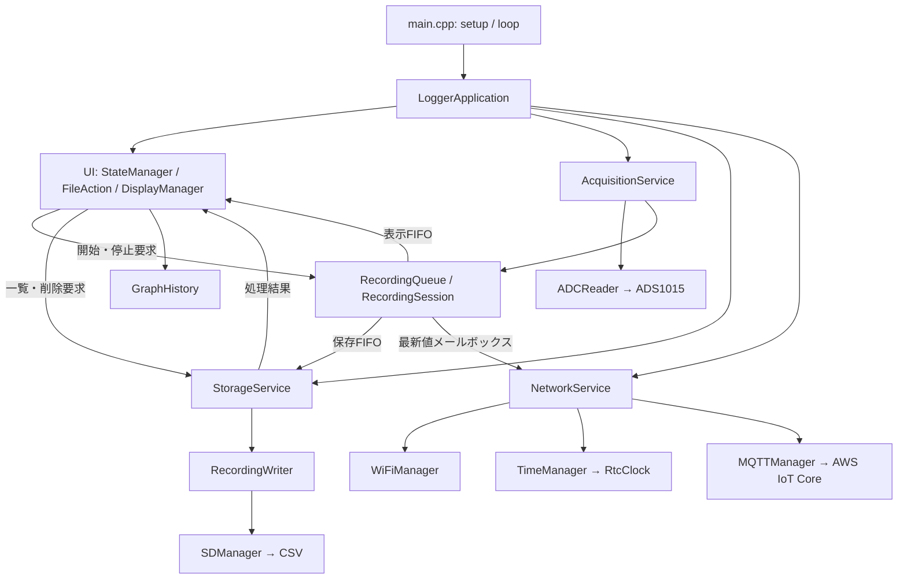
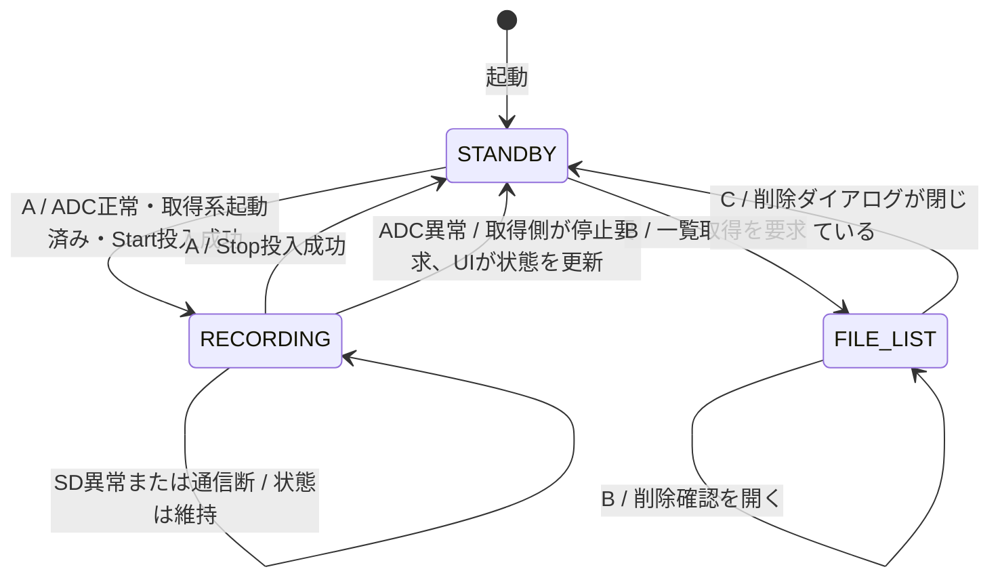
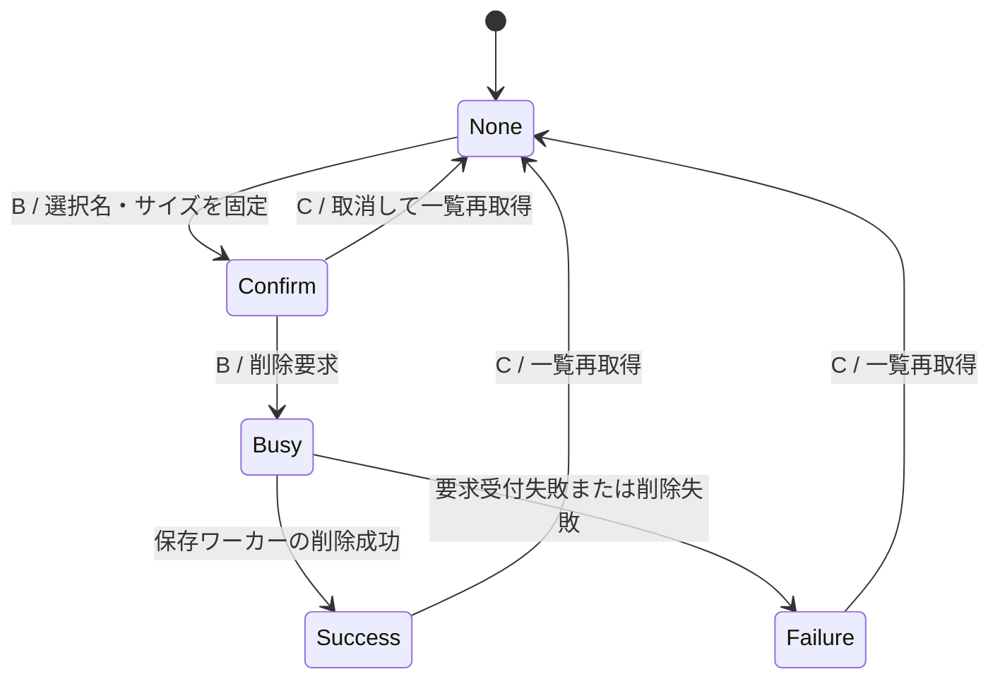
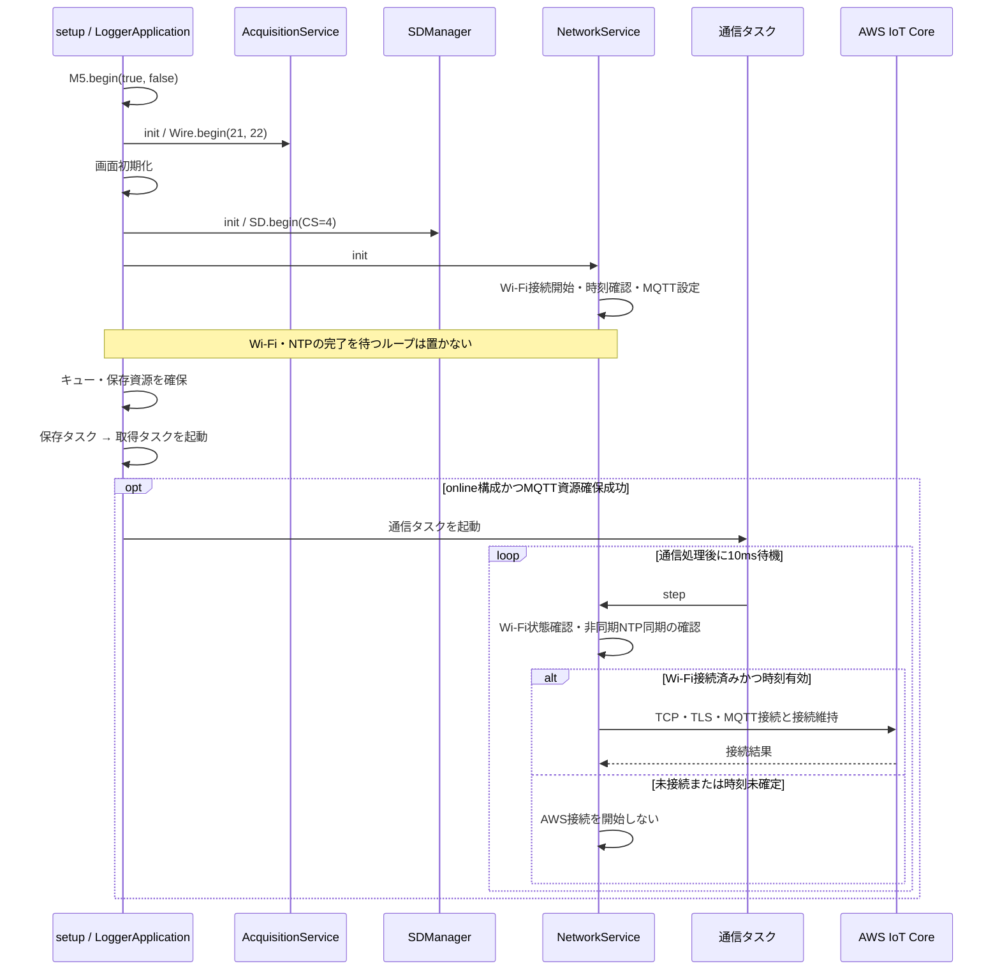
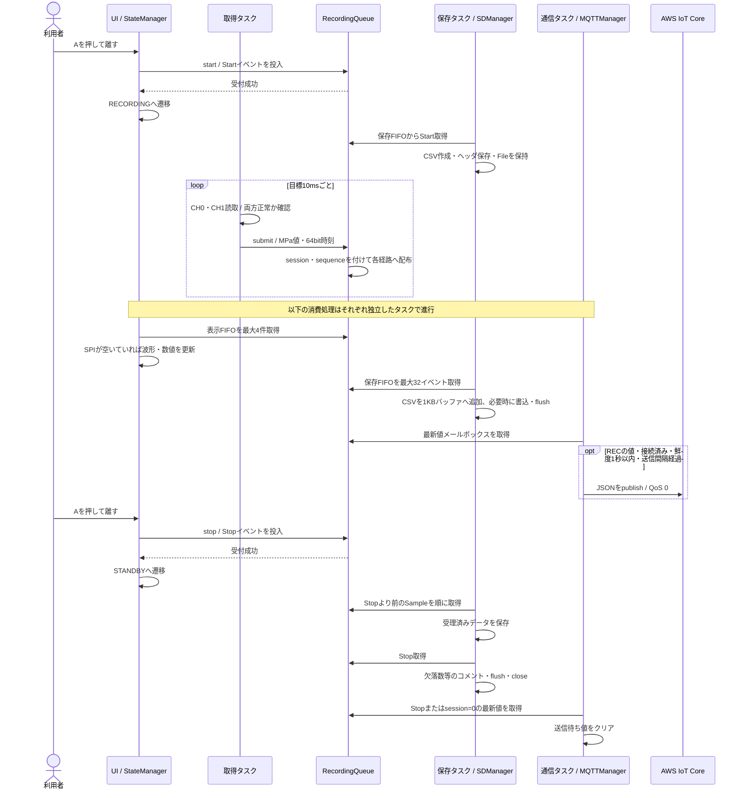
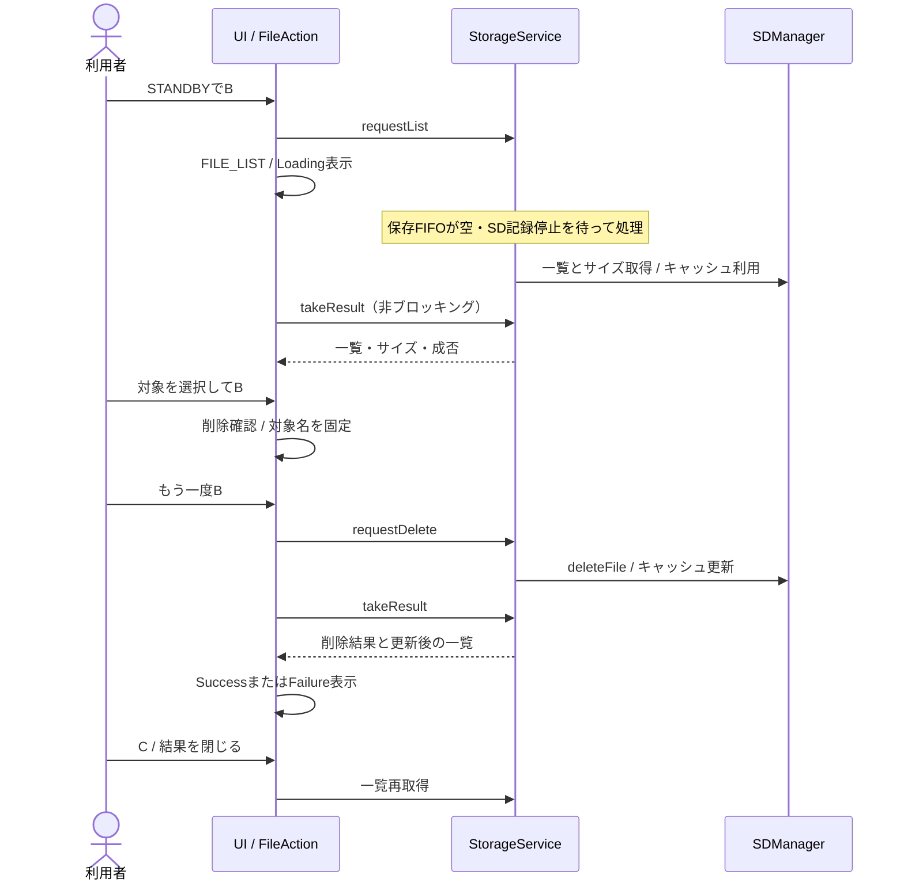

# ソフトウェアアーキテクチャ

本書は`dev`の`2751286`を基準に、起動処理を`LoggerApplication::setup()`へ集約したリファクタリングを反映している（2026-09-24確認）。図はMermaid形式で、GitHubのMarkdownプレビューで表示できる。

操作・配線は[README](../README.md)、AWSの設定は[AWS_SETUP](../AWS_SETUP.md)、検証手順は[LOCAL_TESTS](LOCAL_TESTS.md)を参照する。

## 1. 全体構成と所有関係

M5Stack Basic上でADS1015の2チャンネルを読み、圧力波形の表示、SDへのCSV保存、AWS IoT CoreへのMQTT送信を行う。圧力の単位はMPa。取得周期の目標は10ms（100Hz）で、1サンプルはCH0・CH1と1つの取得時刻の組である。CH0とCH1は順番に変換するため、厳密な同時取得ではない。

[main.cpp](../src/main.cpp)は、静的に保持する`LoggerApplication`へArduinoの`setup()`と`loop()`を委譲する。`LoggerApplication`が各サービスの寿命を所有し、ワーカータスクには`this`を渡す。起動完了後、画面・ボタン操作はUI、ADCは取得、SDは保存、ネットワークI/Oは通信の各タスクが担当する。



`NetworkService`は`WiFiClientSecure`・`WiFiManager`・`TimeManager`・`MQTTManager`を所有する。`StorageService`は保存処理を調停し、`RecordingWriter`を所有するが、`SDManager`と`RecordingQueue`の所有者は`LoggerApplication`である。`StateManager`は画面状態と記録境界を扱い、LCDやSDへ直接アクセスしない。

## 2. 状態遷移図

### 2.1 画面・記録の状態

`SystemState`は`STANDBY`、`RECORDING`、`FILE_LIST`の3状態。変更はUIタスクから`StateManager`経由で行う。Aボタンは押下から離すまで50ms以上を有効操作とし、B・Cは押下イベントで処理する。



| 状態 | 取得・波形 | SD | MQTT | ボタン操作 |
| --- | --- | --- | --- | --- |
| `STANDBY` | 取得と波形更新を継続 | 新規記録なし。停止済みセッションの後処理は残り得る | 接続維持。新規の記録値は送らない | Aで記録開始、Bで一覧 |
| `RECORDING` | 取得と波形更新を継続 | セッションの値を保存。SD異常時は保存のみ停止 | 接続可能なら記録値の最新値を配信 | Aで停止。B・Cによる画面遷移なし |
| `FILE_LIST` | 取得は継続。表示キューは消費するが波形を描かない | ワーカーが一覧・削除を処理 | 接続維持。新規の記録値は送らない | Aで選択、Bで削除確認、Cで波形へ戻る |

記録開始条件のうちADCの正常性は`LoggerApplication`、取得系の起動成否とStart投入成否は`StateManager`が確認する。開始条件を満たさなければ`STANDBY`に留まる。ADCが復旧しても自動でRECへ戻らない。

**画面の`RECORDING`と、SDが実際にファイルを開いている状態は別である。** 開始・停止は非同期なので、状態変更とファイルのopen／closeには時間差がある。LCDの`SD:REC`は`SDManager::isRecording()`、`SD:ERR`はSDの状態から決まる。SD書き込み失敗でもMQTT向けのセッションは継続する。

### 2.2 ファイル削除の状態

`FileAction`は`FILE_LIST`画面内の小さな状態機械で、システム状態とは分離している。確認開始時のファイル名とサイズを保持し、一覧の選択変更に削除対象が左右されないようにする。



ダイアログ表示中は通常の一覧操作よりこちらが優先される。`Busy`中のCは受け付けず、成功・失敗はCを押すまで表示する。`Confirm`・`Success`・`Failure`でのCはダイアログを閉じる操作であり、波形画面へ戻る操作とは別である。

## 3. 基本動作のシーケンス図

### 3.1 起動と通信接続



`M5.begin(true, false)`の第2引数はSD自動初期化の無効化であり、SDの設定と再マウントは`SDManager`に集約する。I²Cは`ADCReader`で明示的に初期化する。起動直後のADC表示は、取得タスクが正常なペアを初めて取得するまで異常表示になり得る。

起動順は保存側が取得側より先。保存資源・保存タスクが起動できなければ取得タスクを起動せず、RECへの遷移も抑止する。通信系だけの起動失敗では取得・ローカル記録を利用できる。

この判断は`LoggerApplication::setup()`内の`if`文で直接行う。保存タスクの起動成否はメンバー`storageTaskReady`、表示する起動エラーは`startupError`へ保持する。取得タスクの起動成否はローカル変数から`StateManager::setRecordingReady()`へ渡す。通信の起動は取得・保存側の失敗にかかわらず判断し、複数の失敗がある場合は先に検出した取得・保存側のエラーを優先して表示する。

### 3.2 記録開始・取得・保存・送信・停止



開始・取得・停止の所属は、`RecordingQueue`の短いクリティカルセクション内で確定する。UIが待機へ戻ったことを理由に、保存待ちのSampleを捨ててはいけない。停止直後に再開始してもFIFOとセッションIDで別ファイルへ分ける。

通信メールボックスは履歴ではなく、Start／Stopも後のイベントで上書きされ得る。受信したSampleの`session`を見て送信対象を判定する。停止前に通信タスクが取り出した1件は、接続処理や送信の途中なら停止操作後に送信される可能性があり、停止済みの通信を取り消す機能はない。

### 3.3 ファイル一覧・削除



UIからSDの列挙・削除APIを直接呼ばず、要求キューを通す。これにより一覧操作もSD書き込みの順序に従う。

## 4. タスク一覧

優先度は数値が大きいほど高い。スタック値は本プロジェクトで使用するESP32環境のバイト数。`loopTask`の値は固定SDKの既定値で、他の3タスクは`LoggerApplication`で指定する。

| タスク名 | Core | 優先度 | スタック | 実行間隔・待機 | 主な責務 |
| --- | --- | --- | --- | --- | --- |
| `loopTask` | 1 | 1 | 8192 | `loop()`内に固定delayなし | 起動処理、ボタン、状態遷移、描画、一覧結果受取。表示キューは1周最大4件 |
| `pressure-sampling` | 1 | 3 | 4096 | `vTaskDelayUntil`で目標10ms周期 | ADCペア読取、異常時停止、各消費側へのサンプル投入 |
| `pressure-storage` | 1 | 1 | 6144 | `step()`後に1ms待機 | 1回最大32イベント、CSV書込・定期flush、一覧・削除 |
| `network-maintenance` | 0 | 0（idleと同じ） | 8192 | `step()`後に10ms待機 | Wi-Fi／NTP状態確認、TLS・MQTT接続、最新値送信。offline時は作らない |

Wi-Fiドライバ、TCP/IP、イベント配送、idle等のSDK内部タスクも動作する。これらの生成・スケジューリングはSDK側の責務で、本表はアプリの処理を担当するタスクを示す。

取得が遅れた場合は基準時刻を更新し、遅れを取り戻すための連続変換をしない。100Hzは目標で、I²C、SPI、RTOS、SD媒体等に左右される。保存・通信の待機は別タスクに分離されているが、CPU・メモリ・バスを共有するため完全に無影響という保証ではない。

通信タスクの低い優先度は、接続処理中にもCore 0のidleタスクへ実行機会を与えるための設定。`step()`内のDNS・TCP・TLS処理は同期I/Oなので、通信処理全体が10msごとに必ず完了するわけではない。

## 5. キュー・同期・時間の扱い

### 5.1 タスク間の受け渡し

| 経路 | 内容・容量 | 生産側 → 消費側 | 満杯・遅延時の扱い |
| --- | --- | --- | --- |
| 保存FIFO | `RecordEvent` × 512 | UI／取得 → 保存 | Startは後続用1枠、Sampleは境界用2枠を残す。Sampleを入れられなければ欠落数を加算 |
| 表示FIFO | `PressureSample` × 512 | 取得 → UI | 待たずに投入。満杯時はその表示用サンプルを捨てる。保存の欠落カウンタには含めない |
| 通信メールボックス | `RecordEvent` × 1 | UI／取得 → 通信 | 常に最新イベントで上書き。通信断中の全履歴は保持しない |
| 一覧・削除要求 | `StorageService::Request` × 1 | UI → 保存 | 非ブロッキング。受付失敗はUIへ返す。ファイル名領域は96バイト |
| 一覧・削除結果 | vector群と完了フラグ | 保存 → UI | `resultMutex`で保護。UIは待たずに取得し、vectorをswapする |

512はバイト数でもチャンネル数でもなく要素数。保存キューには境界イベントも入り、予約枠もあるため、正確に512個の圧力サンプルを常に保持できるわけではない。`max_samples_per_loop=4`は表示経路の制限であり、SDの処理件数制限ではない。

`RecordingQueue::mux`はセッション番号とキュー投入を直列化する。`MQTTManager::mux`は送信待ち値と接続状態・カウンタを保護する。どちらのクリティカルセクション内でも、SD・TLS・LCDなどの時間がかかるI/Oを実行しない。

5秒ごとのシリアル診断に出る保存キューの欠落数・最大使用数は起動後の累積値で、停止時にCSVへ書くコメントはそのセッション内の値である。

SDとLCDはSPIを共有する。`StorageService::busMutex`を保存タスクが取得し、UIは`tryBeginDisplay()`で即時取得できた場合だけ描画する。ボタン処理はこのロックの外で先に実行する。`isAvailable()`等のタスク間状態はatomicな値を参照する。

### 5.2 セッション・圧力・時計

| 値 | 意味 |
| --- | --- |
| `PressureSample::p0 / p1` | MPaの未制限値。ADCカウントから`(count × 0.006 − 1) / 4`で換算 |
| `PressureSample::timestamp` | 正常なペアをキューへ投入するときの`esp_timer_get_time() / 1000`。起動後64bitミリ秒 |
| `session` | 記録セッションのID。0は非記録。再起動でリセット |
| `sequence` | セッション中のサンプル番号。保存キューへ入らなかった試行でも進む |
| CSVの`Timestamp(ms)` | 取得時刻 − Startイベント時刻。ファイルopen時刻を基準にしない |
| MQTTの`timestamp` | 取得時の起動後64bitミリ秒。Unix時刻・送信時刻ではない |
| RTC／NTPの日時 | TLS接続可否、日時付きファイル名、CSVの作成日時コメントに使用 |
| `millis()` | 再試行・flush・UI更新等の間隔測定。32bitの差分で周回を扱う |

波形だけを0〜0.5MPaへ切り詰める。数値表示・CSV・MQTTには元の圧力を使い、表示範囲外フラグは付けない。`GraphHistory`は20秒を138列に割り当て、列内の最小・最大を保持する。線幅2px・枠から2px内側、先頭を識別する空白は7列（約1.015秒）。表示画面を初期化した際は履歴と数値キャッシュもリセットする。

## 6. 障害時の振る舞いと接続設定

| 状況 | 現在の動作 | 主な実装 |
| --- | --- | --- |
| ADC初期化・読取失敗 | 無効ペアを投入せず、記録を停止。1秒間隔で再試行し、復旧後も待機状態 | `ADCReader`、`AcquisitionService` |
| SD書込・flush失敗 | SD保存のみ停止。新たに停止→開始したとき再マウントし、新しいCSVを作る | `SDManager` |
| SDが遅い | 保存FIFOへ滞留。満杯時は保存用の欠落数を加算。表示・通信は別経路 | `RecordingQueue`、`StorageService` |
| Wi-Fi接続・IP取得が遅い | アプリから強制再接続しない。SDKのイベントに基づく自動再接続を利用 | `WiFiManager` |
| NTP未同期 | SDは起動グループ・起動後時刻のファイル名を使い、AWS接続は待つ | `TimeManager`、`SDManager` |
| DNS／TCP／TLS／MQTT接続失敗 | 接続試行の完了から5秒空けて再試行。記録処理は継続 | `MQTTManager` |
| キュー・タスク作成失敗 | 起動結果を画面へ表示。取得系が起動できない場合はRECを拒否 | `LoggerApplication::setup()` |

ADCはアドレス`0x48`、SDA=21、SCL=22、ADS1015の±6.144V・3300SPS設定。ペア読取期限8ms、Wireの転送タイムアウト2msを設けるが、スケジューリングも含めた厳密な実時間上限ではない。

SDはCS=4、SPI=40MHz。記録中はファイルを保持し、1024バイトのバッファがあふれる前にまとめて書く。保存タスクのpollで1秒ごとにflushし、Stop時にもflush／closeする。一覧の名前・サイズはキャッシュし、作成・停止・失敗・再マウント時に無効化する。日時付き、起動グループ付き、旧形式の順に分類し、各分類内では数字部分を数値順に比較する。異なる形式の間の厳密な時系列順を保証するものではない。

接続時の待ち設定はTCP30秒、TLSハンドシェイク30秒、MQTT応答10秒。成功・失敗いずれでも試行後に通常通信の3秒へ戻す。DNSは別の待ち時間を持ち、全体が30秒以内という意味ではない。NTP未同期時はWi-Fi接続を契機に同期要求を出し、その後30秒間隔で再要求する。`isTimeSynced()`は有効なRTC日時を確認する実装であり、毎回NTP応答を待つ関数ではない。

MQTTはQoS 0で、送信試行完了から500ms以上空けて最新値を送る。1秒を超えた値は破棄する。JSONは`timestamp`、`device`、`session`、`sequence`、`ch0`、`ch1`。トピックの設定規約は`pressure_logger/data`で、実際の接続情報は構成ごとの設定ファイルから注入される。ライブラリのpublish成功は、AWS側での永続保存の確認ではない。

電源断時の未flushデータや媒体内部の障害は、アプリの成功判定だけでは保証できない。障害試験の条件・限界は[LOCAL_TESTS](LOCAL_TESTS.md)を参照する。

## 7. 各ファイルの責務

### 7.1 アプリケーションコード（`src/`全ファイル）

`.h`のみの項目は、データ型・テンプレート・インライン実装をそのファイル内に持つ。

| ファイル | 責務・変更時の入口 |
| --- | --- |
| [main.cpp](../src/main.cpp) | アプリインスタンスの寿命を確保し、Arduinoの入口を委譲 |
| [LoggerApplication.h](../src/LoggerApplication.h) / [LoggerApplication.cpp](../src/LoggerApplication.cpp) | サービスの所有、起動順、タスク生成、ボタン処理、UI更新、周期・キュー容量の定義 |
| [StateManager.h](../src/StateManager.h) / [StateManager.cpp](../src/StateManager.cpp) | `SystemState`と記録開始・停止の境界要求 |
| [FileAction.h](../src/FileAction.h) | 削除確認・実行中・結果の状態、削除対象の固定 |
| [ADCReader.h](../src/ADCReader.h) | I²C初期化、ADS1015レジスタ操作、成否・期限検査、MPa換算 |
| [AcquisitionService.h](../src/AcquisitionService.h) | ADC読取を1回分進める、利用可能状態、障害時停止と再試行 |
| [PressureSample.h](../src/PressureSample.h) | 圧力ペア型と単調増加する64bitミリ秒時計 |
| [RecordingSession.h](../src/RecordingSession.h) | `RecordEvent`、Start／Sample／Stop、セッション・連番、必要な予約枠 |
| [RecordingQueue.h](../src/RecordingQueue.h) | FreeRTOSキューへの配布、境界の直列化、欠落数と最大使用数 |
| [RecordingWriter.h](../src/RecordingWriter.h) | 保存イベントを解釈し、セッションごとのSD開始・書込・終了へ変換 |
| [StorageService.h](../src/StorageService.h) | 保存ワーカー、SDとLCDのSPI調停、一覧・削除要求と結果の受け渡し |
| [SDManager.h](../src/SDManager.h) / [SDManager.cpp](../src/SDManager.cpp) | SDマウント、CSV形式、バッファ、ファイル保持、書込検査・復旧、一覧キャッシュ |
| [LogFilename.h](../src/LogFilename.h) | ログ名の分類、数値を考慮した比較、起動番号の抽出 |
| [DisplayManager.h](../src/DisplayManager.h) / [DisplayManager.cpp](../src/DisplayManager.cpp) | LCDレイアウト、波形へのクリッピング、状態表示、SD ERR点滅、一覧と確認画面 |
| [GraphHistory.h](../src/GraphHistory.h) | 時刻を描画列へ変換し、列ごとの最小・最大、空白帯、再描画要否を保持 |
| [NetworkService.h](../src/NetworkService.h) / [NetworkService.cpp](../src/NetworkService.cpp) | 通信オブジェクト所有、設定の注入、Wi-Fi→時刻→MQTTの調停、offlineへの切替 |
| [WiFiManager.h](../src/WiFiManager.h) / [WiFiManager.cpp](../src/WiFiManager.cpp) | 非同期Wi-Fi開始、自動再接続設定、接続状態とIP関連の診断ログ |
| [TimeManager.h](../src/TimeManager.h) / [TimeManager.cpp](../src/TimeManager.cpp) | NTP同期要求、時刻の有効性確認、表示・ファイル用日時文字列 |
| [RtcClock.h](../src/RtcClock.h) / [RtcClock.cpp](../src/RtcClock.cpp) | RTC読取の境界。待機する`getLocalTime()`を避け、`time()`／`localtime_r()`を使用 |
| [MQTTManager.h](../src/MQTTManager.h) / [MQTTManager.cpp](../src/MQTTManager.cpp) | TLS・MQTT設定、接続と再試行、送信間隔・鮮度判定、結果と状態の共有 |
| [Telemetry.h](../src/Telemetry.h) | MQTT向けデータ型とJSONへの変換 |

### 7.2 ビルド・設定・補助ファイル

| ファイル／ディレクトリ | 責務 |
| --- | --- |
| [platformio.ini](../platformio.ini) | ボード、SDK・ライブラリのバージョン、シリアル速度、ビルド環境 |
| [requirements-dev.txt](../requirements-dev.txt) | 開発用PlatformIOのバージョン |
| `secure/config.h` / `secure/aws_certificates.h` | 実機の通信設定と証明書等。アーキテクチャの説明・通常の検証のために内容を参照する必要はない |
| [test/support/FirmwareConfig.h](../test/support/FirmwareConfig.h) | 検証用の公開ダミー設定。実サービスへ接続するための設定ではない |
| [scripts/test.sh](../scripts/test.sh) | 本番クラスとfakeを組み合わせ、online／offlineのホスト試験をASan・UBSan付きで実行 |
| [scripts/check.sh](../scripts/check.sh) | ホスト試験・差分検査・ESP32のvalidation／offlineビルドをまとめて実行 |
| `lib/Adafruit_ADS1X15/` | 以前のADC経路で使っていた外部ライブラリ。現在の実行経路は`ADCReader`の直接読取 |
| `include/README` / `lib/README` / `test/README` | PlatformIOのディレクトリ用途の案内 |
| [README.md](../README.md) / [AWS_SETUP.md](../AWS_SETUP.md) | 利用・配線・構成とAWS接続の手順 |
| [LOCAL_TESTS.md](LOCAL_TESTS.md) / [REVIEW_IMPLEMENTATION.md](REVIEW_IMPLEMENTATION.md) | 検証手順・実装結果の追跡 |
| [repository-review.md](repository-review.md) / [repository-review-2026-09-24.md](repository-review-2026-09-24.md) | 過去のレビュー時点の指摘。現行動作は本書とコードで確認する |

### 7.3 テストファイル

すべてのホスト試験は実ハードウェアの成功保証とは区別する。特にFreeRTOS fakeは、実機のコア間競合・割込み・実時間の再現ではない。

| `test/host/`のファイル | 主な確認対象 |
| --- | --- |
| `Test.h` / `main.cpp` | テスト登録・アサーション・実行と集計 |
| `adc_test.cpp` | I²C初期化、変換・期限、転送失敗、停止と復旧 |
| `application_test.cpp` | 実ボタン入力から記録・削除までの統合、SPI使用中の停止、setupの資源・タスク作成失敗、起動順、通信失敗時のローカル記録 |
| `display_test.cpp` | 波形の端点・ピーク・欠測・空白帯、数値再描画、削除確認 |
| `file_cache_test.cpp` | ファイル名順序、起動番号、一覧キャッシュ、削除失敗 |
| `mqtt_test.cpp` | 接続遅延・期限・再試行、最新値・鮮度、送信結果と診断ログ |
| `network_test.cpp` | Wi-Fi接続を中断しないポーリング、復旧、NTPの非同期処理 |
| `network_mode_test.cpp` | online／offline構成差とローカル記録 |
| `pipeline_test.cpp` | 保存・表示・通信の独立性、バッチ書込、一覧・削除要求の順序 |
| `session_test.cpp` | Start／Stopの順序、予約枠、停止直後の再開始 |
| `sd_mount_test.cpp` | 初回・障害後のSD CSピン |
| `startup_test.cpp` | キューの部分確保失敗とMQTTバッファ確保失敗時の各クラスの安全性 |
| `storage_test.cpp` | 書込長・flush・保存値・取得時刻・CSV・MQTT形式 |
| `rtc_clock_fake.cpp` | OS時計への依存を置き換えるRTC境界 |

| `test/fakes/`のファイル | 置換する境界 |
| --- | --- |
| `Arduino.h` / `esp_timer.h` | String、Serial、32bit／64bit時計 |
| `Wire.h` | I²C初期化・転送・ADS1015応答、失敗注入 |
| `FS.h` / `SD.h` / `SPI.h` | ファイル・カード・SPI、部分書込等の障害 |
| `M5Stack.h` | ボタン入力・LCD描画 |
| `WiFi.h` / `WiFiClientSecure.h` / `PubSubClient.h` | 無線状態・SDK自動再接続の模擬、TLS設定、MQTT遅延・成否 |
| `freertos/FreeRTOS.h` / `queue.h` / `semphr.h` / `task.h` | ロック、キュー、セマフォ、タスク作成と資源不足 |

## 8. 開発時の入口と守る条件

| 変更したい内容 | まず読む実装 | 一緒に確認するテスト |
| --- | --- | --- |
| ボタン・状態・画面遷移 | `LoggerApplication`、`StateManager`、`FileAction` | application、display、session |
| サンプリング周期・ADC換算 | `LoggerApplication`、`ADCReader`、`AcquisitionService` | adc、pipeline |
| CSV・ファイル名・SD性能 | `SDManager`、`LogFilename`、`RecordingWriter` | storage、file_cache、sd_mount、pipeline |
| 波形範囲・時間軸 | `DisplayManager`、`GraphHistory` | display |
| MQTT項目・送信周期 | `Telemetry`、`MQTTManager`、`NetworkService` | mqtt、storage、network_mode |
| Wi-Fi・時刻・起動条件 | `WiFiManager`、`TimeManager`、`RtcClock`、`LoggerApplication::setup()` | network、startup、application |

変更時は、UIから同期SD／通信I/Oを呼ばないこと、保存の境界をFIFOに残すこと、波形の制限を保存・送信値へ持ち込まないことを保つ。キュー容量や取得周期を変える場合は、欠落数・保存処理能力・表示遅延も確認する。通信設定を変える場合は、接続前の待ち時間と接続後の通常通信を区別する。

ビルド構成は以下の3つ。`online`というPlatformIO環境はなく、ホスト試験内でのモード名である。

| PlatformIO環境 | 設定 | 用途 |
| --- | --- | --- |
| `m5stack` | `secure/`の実設定・証明書 | 実機運用。既定環境 |
| `validation` | `PRESSURE_TEST_CONFIG`、公開ダミー設定 | onlineのESP32コンパイル検証。実機への書込み用ではない |
| `offline` | `PRESSURE_OFFLINE` | 通信オブジェクト・通信タスク・実設定を不要にした取得・表示・SD運用 |

`offline`では`NetworkService`が同じ呼出し口を維持しつつ通信を行わず、SDへの時刻源は`nullptr`、LCDは`OFFLINE`になる。ホストのoffline試験では他のクラスの単体試験も走るため、「試験中に通信クラスが一切生成されない」という意味ではない。

コード変更後・コミット前の標準確認は、リポジトリのルートで次を実行する。

```sh
bash scripts/check.sh
```

ホスト試験だけなら`bash scripts/test.sh`を使う。ボタン応答、SD媒体の遅延、実際のADC・Wi-Fi・AWS接続については、[実機検証手順](LOCAL_TESTS.md)に沿って確認する。本書は実装説明であり、ここに書かれた周期・タイムアウトを実機性能の保証として扱わない。
